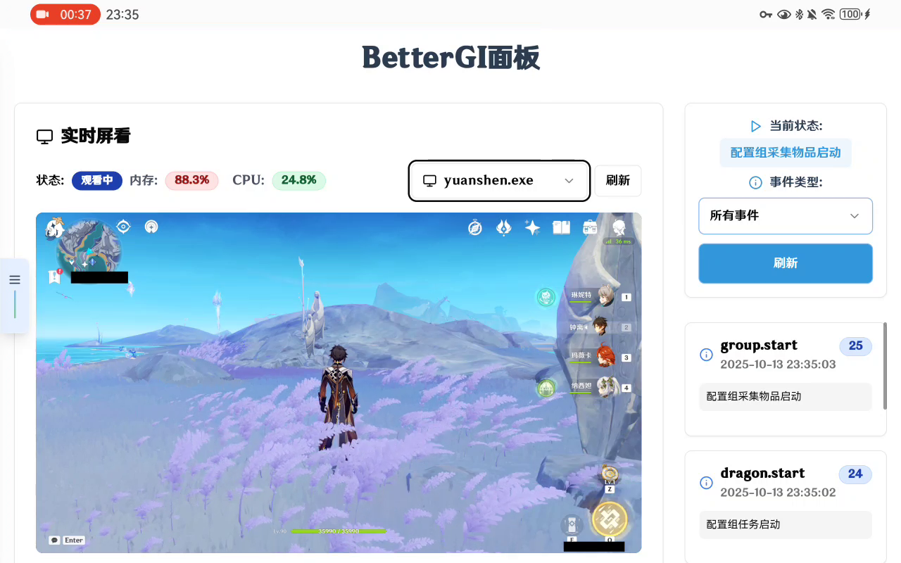
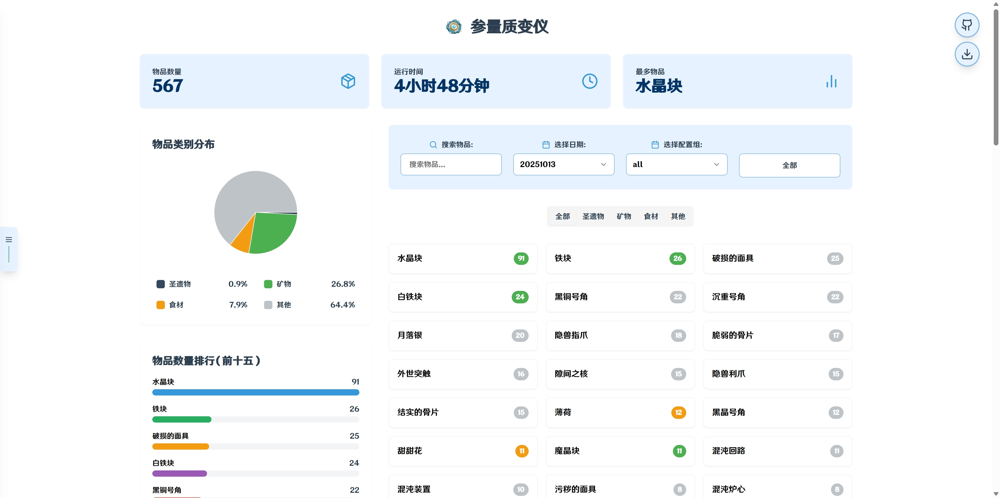

# 参量质变仪：BetterGI日志分析工具 v2.1.0

## 项目介绍

参量质变仪：BetterGI日志分析工具 是一个用于分析BetterGI（Better Genshin Impact）日志文件的应用程序。

该工具提供了直观的Web界面，帮助用户查看和分析BetterGI生成的日志信息，特别是关于游戏中交互和拾取物品的统计数据。

此外还提供了BetterGI面板，可以查阅BGI发送的事件通知、游戏实况和系统监控信息。

经测试，该程序能在Windows 11 24H2版本下正常运行，常驻内存消耗为70M左右。并且出于安全考虑，本项目仅在浏览器中提供信息展示服务，不涉及任何计算机控制与命令执行。你可以自由审查`release`目录下的所有文件。

**注意**：本项目开源，请勿用于商业用途。本项目遵循Apache-2.0 License许可证。

### 主要功能

- 自动检测BetterGI安装路径
- 分析BetterGI日志文件中的各类型事件
- 统计交互或拾取物品的出现次数
- 提供REST API接口进行日志分析
- 通过Web界面直观展示分析结果
- 提供BetterGI面板，查看BGI发送的事件通知、游戏实况
- 实时视频推流功能，支持多程序窗口推流
- 系统监控功能，实时显示内存和CPU使用率
- Webhook数据接收和管理


### 界面截图





### 致谢提交PR的合作开发者
- [xiaocdeh](https://github.com/xiaocdeh)，提交了 https://github.com/Because66666/CanLiang/pull/2

### 致谢提交Issues的关注者
- [crazysmile-PhD](https://github.com/crazysmile-PhD)，提交了 https://github.com/Because66666/CanLiang/issues/4


## 快速开始

### 首次运行

从`release`下载最新版，双击运行。

> 因为使用了`pywin32api`和`pywin32process`，我不确定是否会报告病毒或者否被识别为恶意软件。

项目中关于这两个库的使用集中在`release/app/api/controllers.py`中，主要用于捕获指定程序的视频流并传输到浏览器中。


## 项目结构

```
CanLiang/
├── release/                    # 主要发布版本
│   ├── Canliang.exe           # 主程序可执行文件
│   ├── Canliang.spec          # PyInstaller打包配置
│   ├── app/                   # 应用程序核心模块
│   │   ├── api/              # API接口层
│   │   │   ├── controllers.py # 控制器：业务逻辑处理
│   │   │   └── views.py      # 视图：路由和HTTP处理
│   │   ├── domain/           # 领域模型层
│   │   │   └── entities.py   # 实体定义
│   │   ├── infrastructure/   # 基础设施层
│   │   │   ├── database.py   # 数据库操作
│   │   │   ├── manager.py    # 资源管理
│   │   │   └── utils.py      # 工具函数
│   │   └── static/           # 前端静态文件
│   │       ├── index.html    # 主页面
│   │       ├── home.html     # 首页
│   │       ├── about.html    # 关于页面
│   │       ├── webinfo.html  # BetterGI面板页面
│   │       └── _next/        # Next.js构建输出
│   ├── config.py             # 配置文件
│   ├── run.py                # 程序入口
│   ├── requirements.txt      # Python依赖
│   └── tests/                # 测试文件
├── website/                   # 前端开发源码（Next.js）
│   ├── app/                  # Next.js应用目录
│   ├── components/           # React组件
│   ├── lib/                  # 工具库和API客户端
│   └── public/               # 公共资源
├── old_version/              # 历史版本存档
└── screenshots/              # 项目截图
```

### 架构说明

项目采用分层架构设计：

- **API层** (`app/api/`): 处理HTTP请求和响应
- **领域层** (`app/domain/`): 核心业务逻辑和实体
- **基础设施层** (`app/infrastructure/`): 数据持久化和外部服务
- **静态资源** (`app/static/`): 前端构建后的静态文件

## API接口

### 日志分析相关

#### 获取日志列表

```
GET /api/LogList
```

返回所有可分析的日志文件列表。

**响应示例：**
```json
{
  "list": [
    "20250504",
    "20250503",
    "20250218"
  ]
}
```

**说明：** 日期按从现在到以前排序，最近的日期在列表前面。BGI日志仅保留最近31个文件。

#### 获取所有日志数据

```
GET /api/LogData
```

返回所有日志的分析数据，包括持续时间和物品统计信息。

**响应示例：**
```json
{
  "duration": {
    "日期": ["20250504", "20250503", "20250502"],
    "持续时间": [3600, 7200, 5400]
  },
  "item": {
    "物品名称": ["兽肉", "鸟蛋", "冰晶蝶"],
    "时间": ["14:30:00", "14:35:00", "14:40:00"],
    "日期": ["20250504", "20250504", "20250504"],
    "归属配置组": ["config1", "config1", "config2"]
  }
}
```

### Webhook相关

#### 接收Webhook数据

```
POST /webhook
```

接收BetterGI发送的事件数据并保存。

**请求体：** JSON格式的事件数据

**响应示例：**
```json
{
  "success": true,
  "message": "数据保存成功"
}
```

#### 获取Webhook数据

```
GET /api/webhook-data?limit=100
```

获取已保存的webhook事件数据列表。

**查询参数：**
- `limit` (可选): 返回数据条数，默认100

**响应示例：**
```json
{
  "success": true,
  "data": [
    {
      "event": "success",
      "message": "拾取物品",
      "timestamp": "2025-01-08T10:30:00Z",
      "result": "获得兽肉x1"
    }
  ],
  "count": 1,
  "message": "获取数据成功"
}
```

### 视频推流相关

#### 开始视频推流

```
GET /api/stream?app=yuanshen.exe
```

开始指定应用程序的屏幕推流。

**查询参数：**
- `app` (必需): 目标应用程序名称，必须以.exe结尾

**响应：** MJPEG视频流或错误信息

#### 获取推流信息

```
GET /api/stream/info
```

获取当前推流状态信息。

**响应示例：**
```json
{
  "is_streaming": true,
  "target_app": "yuanshen.exe",
  "stream_url": "/api/stream?app=yuanshen.exe"
}
```

#### 停止推流

```
POST /api/stream/stop
```

停止当前的视频推流。

**响应示例：**
```json
{
  "success": true,
  "message": "推流已停止"
}
```

#### 获取程序列表

```
GET /api/programlist
```

获取当前可推流的程序列表。

**响应示例：**
```json
{
  "success": true,
  "data": ["yuanshen.exe", "bettergi.exe", "桌面.exe"],
  "count": 3,
  "message": "成功获取到 3 个可推流的程序"
}
```

### 系统信息相关

#### 获取系统详细信息

```
GET /api/systemdetail
```

获取系统内存和CPU使用率信息。

**响应示例：**
```json
{
  "success": true,
  "data": {
    "memory_usage": 53.0,
    "cpu_usage": 14.0
  },
  "message": "成功获取系统详细信息"
}
```

### 静态页面路由

- `GET /` - 主页面 (index.html)
- `GET /home` - 首页 (home.html)  
- `GET /about` - 关于页面 (about.html)
- `GET /webinfo` - BetterGI面板页面 (webinfo.html)


## 故障排除

- 确保已安装Python
- 检查防火墙设置，确保允许本地端口3000的访问

## 开发者信息

作者: Because66666
README版本: 1.1.7

## 许可证

本项目遵循Apache-2.0 License许可证。

## 捐赠donate

项目开发不易，所有工作均为开发者Because66666独立开发。捐赠通过二维码：


