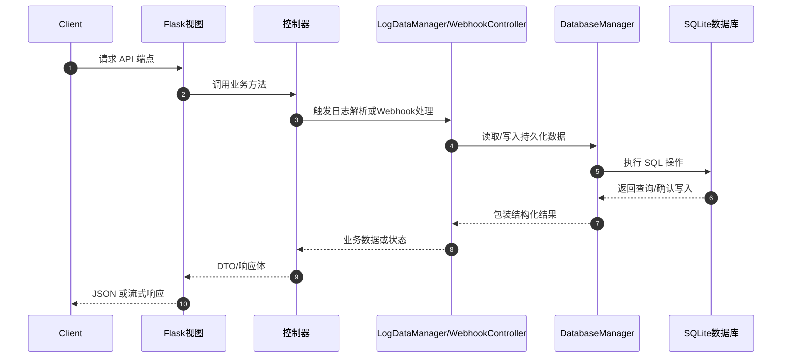

# 请求流架构说明

本文档描述了从客户端发起请求到数据持久化到 SQLite 数据库的完整流程，并使用 Mermaid.js 序列图展示端到端的数据流。

## 架构概览

系统基于 Flask 提供 REST 接口。视图函数首先接收 HTTP 请求并将其委派给相应的控制器，控制器再与领域管理器协作，最终由 `DatabaseManager` 访问 SQLite 数据库。该分层结构使路由、业务逻辑与持久化操作解耦，便于维护与扩展。【F:release/app/api/views.py†L59-L188】【F:release/app/controllers/logs.py†L30-L70】【F:release/app/infrastructure/manager.py†L18-L130】【F:release/app/infrastructure/database.py†L15-L119】

## 日志列表与分析请求（GET /api/LogList、GET /api/LogData）

1. 客户端调用 `/api/LogList` 或 `/api/LogData`。
2. Flask 视图函数校验控制器是否初始化，并调用 `LogController` 的同名方法。【F:release/app/api/views.py†L93-L124】
3. `LogController` 使用 `LogDataManager` 聚合需要返回的数据结构，并在出现异常时提供兜底值。【F:release/app/controllers/logs.py†L39-L70】
4. `LogDataManager` 会在必要时解析新的日志文件，将历史数据写入 SQLite，并从数据库中组合持续时长和物品信息；同时也会读取当日日志补充实时数据。【F:release/app/infrastructure/manager.py†L52-L214】
5. `DatabaseManager` 提供所有持久化操作，包括初始化表结构、插入日志摘要、查询历史统计等，再将结果返回给上层。【F:release/app/infrastructure/database.py†L15-L210】

## Webhook 数据写入（POST /webhook）

1. BetterGI 将事件以 JSON 形式 POST 到 `/webhook`。
2. 视图函数解析请求体，并调用 `WebhookController.save_data` 执行校验与持久化。【F:release/app/api/views.py†L126-L168】
3. `WebhookController` 校验 `event` 字段后，将 payload 交给数据库管理器保存，失败时返回错误信息。【F:release/app/controllers/webhooks.py†L24-L55】
4. `DatabaseManager.save_webhook_data` 构造 INSERT 语句，将事件写入 `post_data` 表并提交事务。【F:release/app/infrastructure/database.py†L243-L307】

## Webhook 数据查询（GET /api/webhook-data）

1. 客户端请求 `/api/webhook-data`，可以通过 `?limit=` 指定返回条数。
2. 路由调用 `WebhookController.get_webhook_data` 获取并包装结果。【F:release/app/api/views.py†L204-L226】
3. 控制器在返回前调用 `DatabaseManager.get_webhook_data`，该方法会先自动清理过期记录，再按时间倒序返回最新事件列表。【F:release/app/controllers/webhooks.py†L57-L74】【F:release/app/infrastructure/database.py†L309-L360】

## Mermaid 序列图

上述流程覆盖日志读取、Webhook 写入以及数据查询三类典型请求，展示了从客户端到数据库的完整链路。
